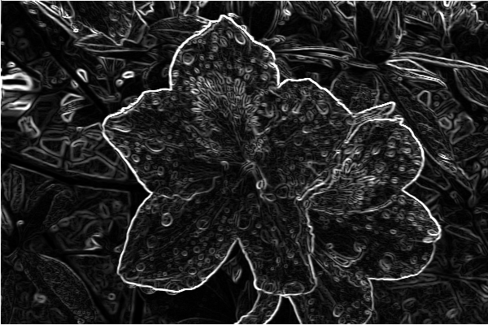

# 107-2 Introduction to Computer Homework

2019 Spring , Introduction to Computer, EE 1003 02

## Usage

### Build  
```
$ make
$ ./<Program name>
```

### Cleanup excutable files
```
$ make clean
```

## HW1 Bitmap image

### Programming Problem
  Rotate a picture conterclockwise by 90 degree.  

### Bonus: PrewiitEdge Detector  
  Implement PrewiitEdge Detector on bitmap picture.  

<table>
  <tr>
    <th>Origin</th>
    <th>PrewiitEdge detector</th>
  </tr>
  <tr>
    <td></td>
    <td></td>
  </tr>
</table>

### Run test  
```
$ make test
$ ./test <Image path>
```
`<Image path>`: images need to be stored in `./img` folder. Ex: `./test test.bmp`

## HW2 Machine Instruction Simulator

### Programming Problem
Machine Instruction Simulator

### Test program (Run single input file)
```
$ make test
$ ./test <Input file index>
```
`<Input file index>`: input1 -> `./test 1`

### Bonus: AssemblySimulator
```
$ make asmSim
```

## HW3 RSA Encryption

### Programming Problem
Implement RSA encryption on string.

### Note
Encoding string to integer by ASCII code, and store 2 characters into 1 integer.  
For example, encoding "AC", A→65 , C→67, let m = 65 * 2<sup>8</sup> + 67, we get m = 16707.   

⚠️ Using "Exponentiation by Squaring" for decryption to avoid overflow. ⚠️  

### Bonus: Matrix multiplication